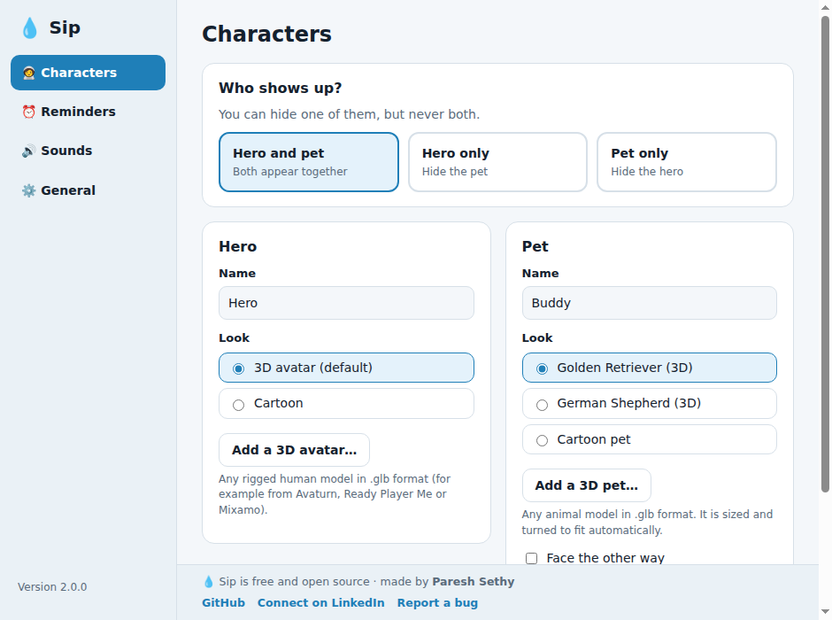
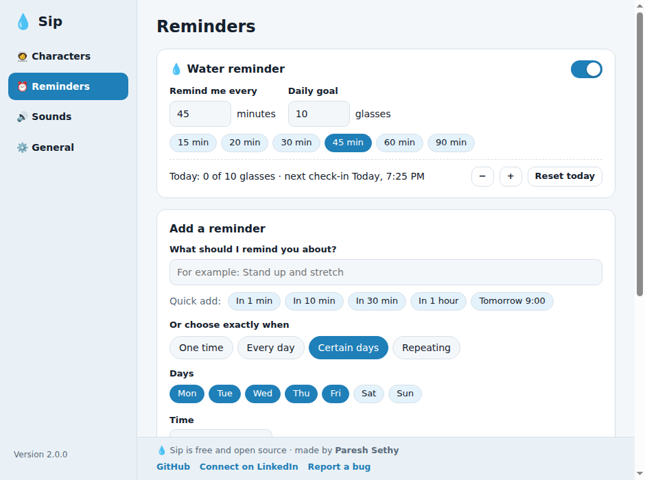
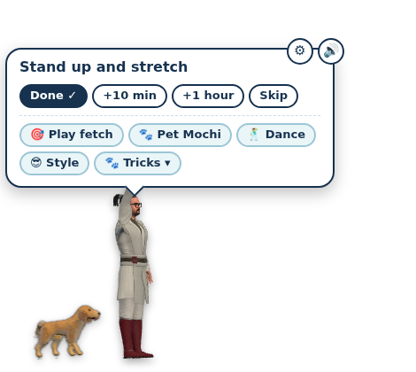

<div align="center">

# 💧 Sip Water Buddy

**A hero and a pet that remind you to drink water, and anything else you tell them to.**

[](https://github.com/vicky-co/sip-water-buddy/actions/workflows/ci.yml)
[](https://github.com/vicky-co/sip-water-buddy/releases/latest)
[](LICENSE)


</div>

Sip is a small desktop companion. A 3D hero (and a pet) walk onto your screen when a reminder is due, do a bit of
showing off, and **stay until you answer**. Water is built in; add any other reminder you like, with dates and times.
It is free, open source, and never connects to the internet.

| Characters | Reminders | On your desktop |
|---|---|---|
|  |  |  |

## Features

- **Water reminder** with your own interval and daily goal. Turn it off if you only want other reminders.
- **Any reminder you like**: one-time (date and time), every day, certain days of the week, or every N minutes/hours.
  Quick-add chips (*In 10 min*, *In 1 hour*, *Tomorrow 9:00*) make the common case a two-second job.
  Answer with *Done*, *+10 min*, *+1 hour* or *Skip*; pause, edit, test or delete from Settings.
- **A hero and a pet**: name them, choose who shows up (**both**, **hero only** or **pet only**; they are never both hidden),
  and pick their looks. Bring your own 3D avatar or pet (`.glb`), and your own pet sounds.
- **Plays along**: fetch (click anywhere on any screen), pet tricks, dance moves, sounds and music, all generated or bundled.
- **A real Settings window** (Characters, Reminders, Sounds, General), light and dark themes, keyboard accessible.
- **Multi-monitor**: the characters walk across all your screens.
- **Private and safe by design**: no network, no telemetry, strict sandboxing (see [SECURITY.md](SECURITY.md)).

## Download and install

Grab the latest build from the **[Releases](https://github.com/vicky-co/sip-water-buddy/releases/latest)** page.

### Windows 10 / 11 (64-bit)
1. Download **`Sip-Water-Buddy-Setup-<version>.exe`** from the release.
2. Double-click it. If Windows says it "protected your PC", choose **More info → Run anyway** (the app is not code-signed yet).
3. Sip installs for your user only (no administrator rights), adds Start menu and desktop shortcuts, and starts. Look for the water-drop icon near the clock
   (click the `^` arrow if hidden) and double-click it to open Settings.

It keeps running when you close any terminal, and starts when you sign in (switchable in Settings). Uninstall from **Settings → Apps → Sip Water Buddy**;
your reminders and settings stay in `%APPDATA%\sip-water-buddy` (delete that folder to remove them too).

Prefer no installer? Download **`Sip-Water-Buddy-<version>-portable.exe`**: a single file you can run from anywhere (it starts a little slower).
Windows support is newer and has had less testing than Linux: please [report anything odd](https://github.com/vicky-co/sip-water-buddy/issues/new/choose).

### Ubuntu / Linux
```bash
unzip sip-water-buddy-<version>-linux.zip && cd sip-water-buddy && ./install.sh
```
Needs Node.js 20+ (the installer offers to install it) and internet once, to fetch the Electron runtime.
Look for the water-drop icon in the top bar. Tested on Ubuntu 24.04 (GNOME); Sip runs through XWayland so it can stay on top.

> **macOS** is not packaged or tested. The code avoids platform-specific assumptions, so running from source may work; contributions welcome.

## A two-minute tour

1. Open **Settings** (double-click the tray icon, or tray → *Open Settings…*).
2. **Characters**: give your hero and pet names; choose *Hero and pet*, *Hero only* or *Pet only*.
3. **Reminders**: type *Stand up and stretch*, tap **In 30 min**. Or choose *Certain days*, pick Mon-Fri, set 09:00, **Add reminder**.
4. When a reminder is due, the characters appear, say it, and wait. **Done ✓**, **+10 min**, **+1 hour** or **Skip**.
5. **Sounds**: pick a pet sound with ▶ Play, or add your own.

## Your data and privacy

- Settings, reminders and added files live in your user profile with owner-only permissions:
  Linux `~/.config/sip-water-buddy/`, Windows `%APPDATA%\sip-water-buddy\`.
- Sip makes **no network requests**; the app blocks them outright. The only time anything leaves the app is when you click a
  link in Settings (GitHub, LinkedIn, bug reports), which opens your normal browser.
- Models and sounds you add are checked, copied into Sip's own folder, and only ever read.
- Logs (for troubleshooting) are in the same folder as `sip.log`; Settings → General → *Open log file*.

## Build and run from source

Requires **Node.js 20+** (22 recommended).

```bash
git clone https://github.com/vicky-co/sip-water-buddy.git
cd sip-water-buddy
npm ci            # installs dev tools and builds the 3D bundle
npm start         # downloads the Electron runtime on first run, then launches Sip
```

| Command | What it does |
|---|---|
| `npm start` | Run from source (adds `--no-sandbox` on Linux only) |
| `npm test` | Unit tests for settings validation and reminder scheduling |
| `npm run lint` | Syntax check of every script |
| `npm run test:e2e` | Launches the real app under a virtual display and drives both windows (Linux, needs `xvfb`) |
| `npm run package:linux` | Builds the Linux zip into `dist/` |
| `npm run package:win` | Builds the Windows installer and portable exe into `dist/installer/` (run it on Windows; GitHub Actions does this for releases) |

## Project structure

```
sip-water-buddy/
├── src/
│   ├── main/            Main process: windows, tray, scheduler, validated IPC (main.js, branding.js)
│   ├── preload/         The only bridges between the windows and the main process
│   ├── shared/          core.js: settings validation + reminder scheduling (pure, fully unit-tested)
│   └── renderer/
│       ├── overlay/     The hero and pet window (3D rendering, animation, sound)
│       ├── settings/    The Settings window
│       └── vendor/      Generated three.js bundle (not committed; built by `npm ci`)
├── assets/              Icons, 3D models, sounds (provenance in assets/README.md)
├── scripts/             Build, packaging and installer scripts (linux/, windows/)
├── tests/               Unit tests and the end-to-end test
├── docs/                Architecture, adding characters, releasing, screenshots
└── .github/             CI, release automation, issue and PR templates
```

More detail: [docs/ARCHITECTURE.md](docs/ARCHITECTURE.md) · [docs/ADDING-CHARACTERS.md](docs/ADDING-CHARACTERS.md) · [docs/RELEASING.md](docs/RELEASING.md)

## Troubleshooting

- **Black box instead of a see-through background**: start Sip with `--no-gpu` (Windows: right-click the shortcut → Properties → add ` --no-gpu` at the end of *Target*; Linux: `SIP_NO_GPU=1`).
- **No 3D hero or pet (cartoon only)**: Settings → General → *Status* shows why. Graphics acceleration problems fall back to software 3D.
- **Nothing happens at the reminder time**: Settings → Reminders shows each reminder's *next* time; use **Test** to preview one.
- **Anything else**: Settings → General → *Open log file*, then [open an issue](https://github.com/vicky-co/sip-water-buddy/issues/new/choose) with the log.

## Contributing

Bug reports, ideas and pull requests are welcome. Please read [CONTRIBUTING.md](CONTRIBUTING.md) first; it is short.
Security problems: see [SECURITY.md](SECURITY.md) and report them privately.

## Credits and licence

Made by **Paresh Sethy**: [GitHub @vicky-co](https://github.com/vicky-co) · [LinkedIn](https://www.linkedin.com/in/pareshsethy1).
If Sip helps you, a ⭐ on the repository is the nicest thank-you, and connecting on LinkedIn is always welcome.

The code is released under the [MIT licence](LICENSE). Third-party software and the 3D models and sounds have their own terms:
see [THIRD_PARTY_NOTICES.md](THIRD_PARTY_NOTICES.md) and [assets/README.md](assets/README.md).
