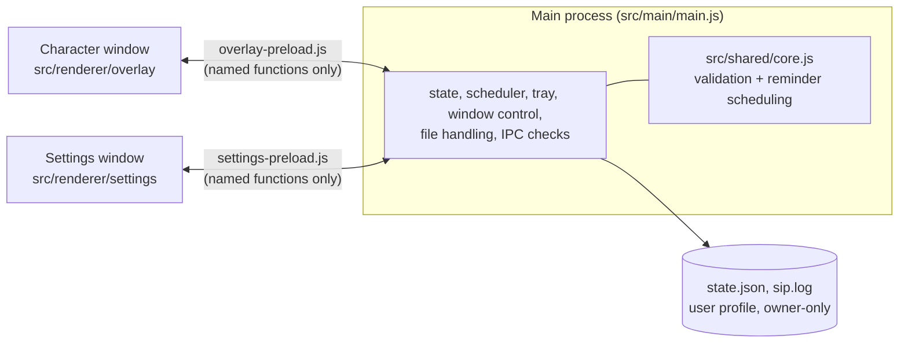

# Architecture

Sip is an [Electron](https://www.electronjs.org/) app with **one main process** and **two windows**. There is no framework and no bundler for app code:
plain JavaScript, with one generated file (the three.js bundle).

## Pieces

| Piece | Where | Job |
|---|---|---|
| Main process | `src/main/main.js` | Owns all state. Creates the transparent always-on-top **character window** and the **Settings window**, the tray icon, the scheduler (ticks every 5 s), and every IPC handler. |
| Core logic | `src/shared/core.js` | Pure functions, no Electron/Node APIs: migrate and validate settings (`normalize`, `applyPatch`), build and update reminders (`makeReminder`, `updateReminder`), compute due times (`nextDue`), decide what shows next (`pickNext`) and apply answers (`applyFinish`). Fully unit-tested. |
| Branding | `src/main/branding.js` | Author name and the four external links shown in Settings. |
| Preloads | `src/preload/*.js` | Expose a fixed list of functions to each window via `contextBridge`. |
| Character window | `src/renderer/overlay/` | Draws the hero and pet (3D via three.js, with a 2D cartoon fallback), runs the animation sequencer, speech bubble, sounds (Web Audio, synthesised) and play activities. |
| Settings window | `src/renderer/settings/` | Renders from a state object sent by the main process; every change is sent back as a validated patch. |

## A reminder, end to end
1. The scheduler tick calls `Core.pickNext(state, waterNextAt, now)`. Reminders that are due come first (earliest first), then water.
2. `appear()` positions the character window on the screen nearest the cursor and sends an `appear` message with the item (water, reminder or hello), names, settings and screen areas.
3. The character window runs a scripted sequence (land, walk, move, ask), then **waits** with buttons. Idle time is filled with flourishes and pet tricks.
4. The answer goes back as `done({ type, id, action, minutes })`. The main process sanitises it, calls `Core.applyFinish`, saves, hides the window and refreshes the tray and Settings.

## State
`state.json` (versioned, `v: 2`) holds water settings, hero/pet names and looks, who is visible (`show: both | hero | pet`), sound settings, the reminders list, and today's glass count.
`Core.normalize` accepts anything (including files from version 1, which it migrates) and returns a fully valid state, so a damaged or hand-edited file can never crash the app.
Saves are atomic (write a temp file, then rename) with owner-only permissions.

## IPC reference
Every handler first checks that the sender is the expected window **and** that its page is one of Sip's own files.

| Direction | Channel | Notes |
|---|---|---|
| overlay → main | `move`, `click-through`, `done`, `open-settings`, `status`, `set-setting`, `avatar-error`, `pet-error` | Numbers are clamped; `set-setting` can only change mute and pet speed. |
| overlay → main (invoke) | `load-avatar`, `load-pet`, `load-sound`, `log-glass` | Ids resolve only to Sip's own assets or to bare file names in the user folders. |
| main → overlay | `appear`, `settings`, `test-sound` | |
| settings → main (invoke) | `settings:get`, `patch`, `add-file`, `remove-file`, `play-sound`, `reminder-add`, `reminder-update`, `reminder-delete`, `reminder-clear-done`, `reminder-test`, `water`, `ask-now`, `open-link`, `open-log` | `patch` goes through `Core.applyPatch`; `open-link` takes a key from a fixed allowlist. |
| main → settings | `settings:state`, `settings:notice`, `settings:navigate` | |

## Characters
- **Hero** (`avatar3d.js`): a rigged humanoid. The animation system produces 2D-style pose numbers (leg/arm angles, bob, sway); `avatar3d.js` maps them onto the model's bones, adapting to T-pose or A-pose rigs and normalising height.
- **Pet** (`pet3d.js`): rigged models use their own `Idle/Walk/Run` clips (speed-matched to how fast the pet really moves) plus per-frame bone offsets for tricks. Models without a skeleton get an automatic leg/head/tail rig.
- **Cartoon fallbacks** are SVG and are always available.

## Security design
See [SECURITY.md](../SECURITY.md) for the model and [CONTRIBUTING.md](../CONTRIBUTING.md) for the rules contributors follow.
The CSP of each page forbids inline code, the main process denies navigation, new windows and permissions, and all web requests are cancelled.

## Testing
- `tests/core.test.js`: the logic, across time zones and a daylight-saving change.
- `tests/e2e/selftest.js`: starts the real app (real preloads, real windows) under a virtual display and checks behaviour, IPC validation, hide modes, reminders and the security properties; it also takes the screenshots in `docs/screenshots`.
